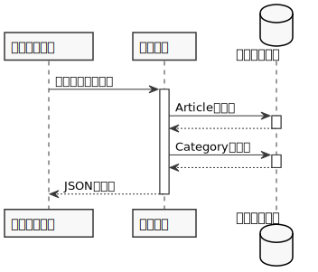
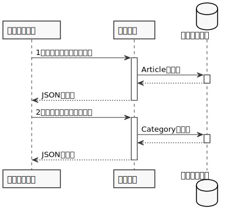

<style>
    div.two-columns {
        display: grid;
        grid-gap: 1rem;
    }
    div.left-column {
        grid-column: 1;
    }
    div.right-column {
        grid-column: 2;
    }
</style>

# Spring GraphQL Introduction

---

## 概要

- [Spring GraphQL](https://github.com/spring-projects/spring-graphql)のマイルストーンバージョンが発表された
- GraphQLは良いものだと思うので、みなさんにもSpring GraphQLを知ってもらいたい！
- まずGraphQLについて簡単に説明
- それからSpring GraphQLを使ったサーバー側の実装方法を説明

---

## 自己紹介

- うらがみ ([@backpaper0](https://github.com/backpaper0))
- TIS株式会社
- 仕事でGraphQL使っていないし、素振りもこれから

---

## 前置き

- この発表はSpring GraphQL 1.0.0-M1をもとにしています
- GraphQLの仕様はCurrent Working Draftを参考にしています
- スライドに現れるコードは説明のため一部省略していることがあります

---

## このスライドとコード例の置き場所

- https://github.com/backpaper0/spring-graphql-introduction

---

<!-- _class: lead -->

# GraphQL

---

## GraphQLとは

GraphQLはAPIのためのクエリ言語

公式サイトのランディングページで書かれている特徴

- 型システムによって何ができるのかが分かる
- 必要なものを問い合わせて取得できる
- 1回のリクエストで多くのリソースを取得
- バージョンなしでAPIを進化させられる

---

### 特徴：型システムによって何ができるのかが分かる

- GraphQLは
    - データを表す型を定義して、その型を使用してクエリを実行する
    - 特定のデータベースやストレージには依存していない

---

### 型定義の例：ブログ記事とカテゴリー

<div class="two-columns">

<div class="left-column">

```gql
type Article {
    id: ID
    title: String
    content: String
    category: Category
}

type Category {
    id: ID
    name: String
}

type Query {
    article(id: ID): Article
}
```

</div>

<div class="right-column">

```gql
query {
  article(id: "1") {
    id
    title
    content
    category {
      id
      name
    }
  }
}
```

</div>

</div>

---

### 特別な型：QueryとMutationとSubscription

- GraphQLは3つの型を特別扱いする
    - `Query`はデータ取得のための型で`query`操作に対応する
    - `Mutation`はデータ更新のための型で`mutation`操作に対応する
    - `Subscription`はイベントをサブスクライブするための型で`subscription`操作に対応する
- これらの型と操作の関連付けは`schema`キーワードでカスタマイズできる
  ```gql
  schema {
      query: MyQuery
  }
  ```

---

### Mutationの例

型定義

```gql
type Mutation {
  newArticle(title: String, content: String, categoryId: ID): Article
}
```

`mutation`操作

```gql
mutation {
  newArticle(title: "...", content: "...", categoryId: "1") {
    id
  }
}
```

---

### Subscriptionの例

型定義

```gql
type Subscription {
  updatedArticle: Article
}
```

`subscription`操作

```gql
subscription {
  updatedArticle {
    title
  }
}
```

---

### 特徴：必要なものを問い合わせて取得できる

- GraphQLのクエリは型定義をもとにして必要とするフィールドを指定する
- レスポンスは指定されたフィールドを返す
- クライアントが必要とするものだけを明確に取得できる

---

### クエリの例：ブログ記事とカテゴリー

<div class="two-columns">

<div class="left-column">

クエリ

```gql
query {
  article(id: "1") {
    title
    category {
      name
    }
  }
}
```

</div>

<div class="right-column">

結果(JSON)

```json
{
  "data": {
    "article": {
      "title": "Spring GraphQL introduction",
      "category": {
        "name": "Spring"
      }
    }
  }
}
```

</div>

</div>

---

### 特徴：1回のリクエストで多くのリソースを取得

- GraphQLは1回のリクエストでルートとなるデータから関連を辿ってデータを取得して返す
- また、1回のリクエストでクエリを複数個送信することも可能

   ```gql
   query {
       article1: article(id: "3") { title }
       article2: article(id: "4") { title }
   }
   ```

---

### GraphQLとREST、リクエスト回数の比較

<div class="two-columns">

<div class="left-column">

GraphQL



</div>

<div class="right-column">

REST



</div>

</div>

---

### 特徴：バージョンなしでAPIを進化させられる

- クライアントは必要となるフィールドを明確に指定してクエリを組み立てるため、型にフィールドが追加されても影響が無い
- フィールド削除のために、それを予告する`@deprecated`ディレクティブが用意されている

  ```gql
  type Article {
      id: ID
      title: String
      body: String @deprecated(reason: "代わりに`content`を使うこと")
      content: String
      category: Category
  }
  ```

---

## GraphQLの嬉しいところ

- 型を定義するだけでクライアントは欲しいデータに合わせてクエリを組み立てられる
    - REST/OpenAPIだと欲しいデータの分だけエンドポイントを定義しないといけない
- クエリがプログラミング言語に依存しておらず、クエリエディタで書いたものをそのままプログラムに組み込める
    - OpenAPIにおけるクエリはHTTPリクエストなため言語非依存と言えるが、低レイヤーなため言語/ライブラリのAPIになっておりポータビリティは高いとは思えない

---

<!-- _class: lead -->

# Spring GraphQL

---

## Spring GraphQLとは

- SpringアプリケーションでGraphQLのサーバー側を実装できる
- Spring Web MVCとSpring WebFluxの両方に対応
- [GraphQL Java](https://github.com/graphql-java/graphql-java)を使用している
- Spring Boot Starterが用意されている
- テストをサポートするクラスが用意されている

---

<!-- _class: lead -->

# 使用準備

---

## pom.xmlへ依存を追加する

```xml
<dependency>
    <groupId>org.springframework.experimental</groupId>
    <artifactId>graphql-spring-boot-starter</artifactId>
    <version>1.0.0-M1</version>
</dependency>
<!-- もしくは spring-boot-starter-webflux -->
<dependency>
    <groupId>org.springframework.boot</groupId>
    <artifactId>spring-boot-starter-web</artifactId>
</dependency>
```

---

## Subscriptionを使う場合はwebsocketも追加

```xml
<dependency>
    <groupId>org.springframework.boot</groupId>
    <artifactId>spring-boot-starter-websocket</artifactId>
</dependency>
```

---

## テストのための依存も追加する

```xml
<dependency>
    <groupId>org.springframework.graphql</groupId>
    <artifactId>spring-graphql-test</artifactId>
    <version>1.0.0-M1</version>
    <scope>test</scope>
</dependency>
<!-- WebTestClient のため必要になるっぽい -->
<dependency>
    <groupId>org.springframework</groupId>
    <artifactId>spring-webflux</artifactId>
    <scope>test</scope>
</dependency>
```

---

## 型定義を配置する

- クラスパス上の`graphql`ディレクトリ内の次の拡張子のファイルが読み込み対象となる
    - `.graphqls`
    - `.graphql`
    - `.gql`
    - `.gqls`
- とりあえず`src/main/resources/graphql/schema.gql`にでも書いておけばOK

---

## 開発時に便利な設定

GraphiQLというGraphQLのGUIクライアントを有効化する

```properties
spring.graphql.graphiql.enabled=true
```

---

<!-- _class: lead -->

# サーバーサイドの実装方法

---

## データのフェッチ方法を定義する

やることは次の通り。

- `org.springframework.graphql.boot.RuntimeWiringBuilderCustomizer`を実装したコンポーネントを用意する
- `customize`メソッドで引数の`graphql.schema.idl.RuntimeWiring.Builder`を使用してデータのフェッチ方法を定義する

---

## データのフェッチ方法を定義する

```java
@Component
public class ArticleDataWriring implements RuntimeWiringBuilderCustomizer {

    @Override
    public void customize(RuntimeWiring.Builder builder) {
        builder.type("Query", b -> b.dataFetcher("article", env -> {
            Integer id = Integer.valueOf(env.getArgument("id"));
            return articleRepository.findById(id);
        }));
        builder.type("Article", b -> b.dataFetcher("category", env -> {
            Article article = env.getSource();
            return categoryRepository.findById(article.getCategoryId());
        }));
    }
}
```

---

## データのフェッチ方法を定義する

```gql
type Article {
    id: ID
    title: String
    content: String
    category: Category
}

type Category {
    id: ID
    name: String
}

type Query {
    article(id: ID): Article
}
```

---

<!-- _class: lead -->

# デモ

---

## DataFetcher.getの戻り値の型

```java
public interface DataFetcher<T> {

    T get(DataFetchingEnvironment environment) throws Exception;
}
```

---

## DataFetcher.getの戻り値の型

- `T`
- `java.util.Optional<T>`
- `java.lang.Iterable<T>`, `java.util.stream.Stream<T>`, `java.util.Iterator<T>`, 配列
- `reactor.core.publisher.Mono<T>`, `reactor.core.publisher.Flux<T>`
- `graphql.execution.DataFetcherResult<T>`
- `java.util.concurrent.CompletionStage<T>`

---

<!-- _class: lead -->

# テスト

---

## テストの書き方

- テストクラスに`@AutoConfigureGraphQlTester`を付ける
- `GraphQlTester`をインジェクションする
- テストメソッドで`GraphQlTester`を使ってテストをする

---

### テストクラスの例

```java
@SpringBootTest
@AutoConfigureMockMvc
@AutoConfigureGraphQlTester
public class BlogTest {

    @Autowired
    private GraphQlTester graphQlTester;

    @Test
    void article() {
        // GraphQlTesterを使ったテストコードをここに書く
    }
}
```

---

### クエリの構築

`GraphQlTester`へ渡すクエリを構築する

```java
String query = "{" +
        "  article(id: 1) {" +
        "    title" +
        "    category {" +
        "      name" +
        "    }" +
        "  }" +
        "}";
```

---

### クエリの構築

最近のJavaならテキストブロックで書けてありがたい

```java
String query = """
        {
            article(id: 1) {
                title
                category {
                    name
                }
            }
        }
        """;
```

---

### クエリの実行とアサーション

```java
graphQlTester.query(query)
        .execute()

        .path("article.title")
        .entity(String.class)
        .isEqualTo("Spring GraphQL introduction")

        .path("article.category.name")
        .entity(String.class)
        .isEqualTo("GraphQL");
```

※なお`path`メソッドに渡すパスには[JsonPath](https://github.com/json-path/JsonPath)が使える

---

<!-- _class: lead -->

# N + 1問題

---

## N + 1問題とは

- 主にDBアクセス周りで言及される話題
- ループの中で都度クエリを発行してパフォーマンス低下を招いてしまう問題
- 例：`select * from article`で`article`を複数件取得、取得した`article`をループしながら`select * from category where id = ?`で`category`を取得する
    - 最初の1回 + `article`の件数分のクエリが発行されてしまう

---

## N + 1問題の解決策：DataLoader

- DBアクセスであればテーブルを結合すれば解決できる
- GraphQLではDataLoaderを使う
- 先程の例を使って雑に述べると`select * from category where id = ?`をN回行っていたところを、`select * from category where id in (...)`を1回行うようにする

---

## DataLoaderを使った実装方法

- `org.dataloader.BatchLoader`を実装したクラスを作る
- `org.springframework.graphql.web.WebInterceptor`を実装したクラスを用意して`intercept`メソッドでリクエストオブジェクトへDataLoaderを登録する
- データフェッチ時に`env`からDataLoaderを取り出し、`load`メソッドを使用する

---

### BatchLoaderの実装例

```java
@Component
public class AuthorLoader implements BatchLoader<Integer, Author> {

    private final AuthorRepository authorRepository;

    @Override
    public CompletionStage<List<Author>> load(List<Integer> keys) {
        List<Author> authors = authorRepository.findAllById(keys);
        return CompletableFuture.completedStage(authors);
    }
}
```

---

### WebInterceptorでDataLoaderを登録

```java
@Component
public class AuthorLoaderRegistration implements WebInterceptor {

    private final AuthorLoader authorLoader;

    @Override
    public Mono<WebOutput> intercept(WebInput webInput, WebGraphQlHandler next) {
        webInput.configureExecutionInput((input, builder) -> {
            DataLoaderRegistry registry = new DataLoaderRegistry();
            DataLoader<Integer, Author> dataLoader = DataLoader.newDataLoader(authorLoader);
            registry.register("authorLoader", dataLoader);
            return builder.dataLoaderRegistry(registry).build();
        });
        return next.handle(webInput);
    }
}
```

---

### DataLoaderでデータフェッチ

```java
@Component
public class ComicDataWiring implements RuntimeWiringBuilderCustomizer {

    @Override
    public void customize(RuntimeWiring.Builder paramBuilder) {
        paramBuilder.type("Comic", b -> b.dataFetcher("author", env -> {
            Comic source = env.getSource();
            DataLoader<Integer, Author> authorLoader = env.getDataLoader("authorLoader");
            return authorLoader.load(source.getAuthorId());
        }));
    }
}
```

---

<!-- _class: lead -->

# デモ

---

## DataLoader

- `DataLoaderOptions`の`maxBatchSize`でバッチサイズを設定できる
- `BatchLoader`の他に`MappedBatchLoader`がある

  ```java
  public interface BatchLoader<K, V> {
      CompletionStage<List<V>> load(List<K> keys);
  }
  ```

  ```java
  public interface MappedBatchLoader<K, V> {
      CompletionStage<Map<K, V>> load(Set<K> keys);
  }
  ```

---

<!-- _class: lead -->

# ページング

---

## 公式オススメのページング

- GraphQL公式ガイドに[Pagination](https://graphql.org/learn/pagination/)というドキュメントがある
- ページングのオススメ方式が説明されており、最後に[Relay](https://relay.dev/)の[GraphQL Cursor Connections Specification](https://relay.dev/graphql/connections.htm)が紹介されている
    - > Relay is a JavaScript framework for building data-driven React applications.

---

## GraphQL Cursor Connections Specification

- 末尾に`Connection`と付いた型を定義する
- フィールドは`edges`と`pageInfo`
- `edges`はリストで各要素は返したい型とカーソルのペア
- `pageInfo`は返されたページの情報
- クエリは1ページの最大要素数と条件となるカーソルを受け取る
- カーソルは`String`または`String`にシリアライズされるカスタム`scalar`

---

## Connections例：型定義

```gql
type ExampleConnection {
    edges: [ExampleEdge!]!
    pageInfo: PageInfo!
}
type ExampleEdge {
    node: Example!
    cursor: String!
}
type PageInfo {
    hasPreviousPage: Boolean!
    hasNextPage: Boolean!
    startCursor: String
    endCursor: String
}
```
---

## Connections例：クエリ定義

```gql
type Query {
    # 前方のカーソル
    exampleForward(first: Int! = 10, after: String): ExampleConnection!
    # 後方のカーソル
    exampleBackward(last: Int! = 10, before: String): ExampleConnection!
}
```

- なお、前方と後方のどちらの場合も返されるエッジの順序は同じにする必要がある
- 前方は`3, 4, 5...`、後方は`5, 4, 3...`とするのはダメということ

---

## Connections例：クエリ

```gql
query {
  exampleForward(first: 10, after: "...") {
    edges {
      node { field1 field2 field3 }
      cursor
    }
    pageInfo {
      hasPreviousPage
      hasNextPage
      startCursor
      endCursor
    }
  }
}
```

---

## Spring GraphQLでConnections

- Spring GraphQLで、というかGraphQL Javaで用意されているクラスを使う
    - `graphql.relay.Connection<T>`
    - `graphql.relay.Edge<T>`
    - `graphql.relay.ConnectionCursor`
    - `graphql.relay.PageInfo`

---

## Connections実装例：DataFetcher全体

```java
paramBuilder.type("Query", b -> b.dataFetcher("exampleForward", env -> {
    int pageSize = env.getArgument("first");
    String conditionCursor = env.getArgument("after");

    List<Edge<Example>> edges = ...

    PageInfo pageInfo = ...

    return new DefaultConnection<>(edges, pageInfo);
}));
```

---

## Connections実装例：Edgeのリスト構築

```java
List<Example> examples = ...

List<Edge<Example>> edges = examples.stream().map(example -> {
    ConnectionCursor cursor = new DefaultConnectionCursor(example.getId());
    return new DefaultEdge<>(example, cursor);
}).collect(Collectors.toList());
```

---

## Connections実装例：PageInfo構築

```java
ConnectionCursor startCursor = new DefaultConnectionCursor("...");
ConnectionCursor endCursor = new DefaultConnectionCursor("...");
boolean hasPreviousPage = ...
boolean hasNextPage = ...

PageInfo pageInfo = new DefaultPageInfo(
    startCursor, endCursor, hasPreviousPage, hasNextPage);
```

---

<!-- _class: lead -->

# デモ

---

<!-- _class: lead -->

# エラーの返却と例外ハンドリング

---

## GraphQLのエラー表現

GraphQLの仕様にはエラーの表現も含まれている

```json
{
    "errors": [
        {
            "message": "...",
            "location": [{"line": 1, "column": 2}],
            "path": ["path", "to", "field"]
        }
    ]
}
```

---

### Spring GraphQLでエラーを返す

`DataFetcher`から例外をスローするとエラーに変換して返してくれる

```java
paramBuilder.type("Query", b -> b.dataFetcher("hello", env -> {
    throw new Exception("Exception occurred while processing hello");
}));
```

```json
{
    "errors": [{
        "message": "Exception occurred while processing Foo.bar",
        "location": [{"line": 1, "column": 2}],
        "path": ["hello"]
    }]
}
```

---

### Spring GraphQLでの例外ハンドリング

例外をハンドリングする場合は`DataFetcherExceptionResolver`を実装する

```java
@Component
public class MyExceptionResolver implements DataFetcherExceptionResolver {
    @Override
    public Mono<List<GraphQLError>> resolveException(
                Throwable e, DataFetchingEnvironment env) {
        if(e instanceof MyException) {
            GraphQLError error = GraphqlErrorBuilder.newError(env).message("...").build();
            return Mono.just(List.of(error));
        }
        return Mono.empty();
    }
}
```

---

<!-- _class: lead -->

# その他の話題

---

## 紹介していないGraphQLの仕様はまだまだある

- Scalar
- Interface
- Union
- Enum
- Input Object
- Directive

ScalarとEnumの実装方法を簡単に説明

---

### Scalarの実装方法

```gql
scalar URI
```

```java
Coercing<?, ?> coercing = new URICoercing();
GraphQLScalarType scalarType = GraphQLScalarType.newScalar()
    .name("URI").coercing(coercing).build();
// typeメソッドではなくscalarメソッドで定義する
paramBuilder.scalar(scalarType);
```

---

### Scalarの実装方法

```java
public class URICoercing implements Coercing<URI, String> {
    @Override
    public String serialize(Object dataFetcherResult) throws CoercingSerializeException {
        return dataFetcherResult.toString();
    }

    @Override
    public URI parseValue(Object input) throws CoercingParseValueException {
        return URI.create((String) input);
    }

    @Override
    public URI parseLiteral(Object input) throws CoercingParseLiteralException {
        return URI.create(((StringValue) input).getValue());
    }
}
```

---

### Enumの実装方法

```gql
enum Visibility {
    PUBLIC
    PRIVATE
}
```

```java
public enum Visibility {
    PUBLIC,
    PRIVATE;
}
```

```java
EnumValuesProvider enumValuesProvider = new NaturalEnumValuesProvider<>(Visibility.class);
// dataFetcherメソッドではなくenumValuesメソッドで定義する
paramBuilder.type("Visibility", b -> b.enumValues(enumValuesProvider));
```

---

## GraphQLに合わないAPIが欲しいときは？

例えば

- 複雑なテーブル結合を必要とするクエリ
- バイナリデータを返したい(ダウンロード)

など

そういった場合はRestControllerを書けば良い(Spring Web MVC/Spring WebFluxが土台になっている強み)

---

## コンテキストの伝播

GraphQL Javaから呼び出される`DataFetcher`などのコンポーネントはSpring Web MVCのリクエストをハンドリングするスレッドと同じスレッドで実行されるとは限らない

そのためスレッドローカルで持ち回すような値は`org.springframework.graphql.execution.ThreadLocalAccessor`を実装して伝搬させてあげる必要がある

詳しくはSpring GraphQLリファレンスのContext Propagationセクションを参照

---

## 認証・認可はどうする？

- GraphQLのエンドポイントは単一なため、エンドポイントに対する認証・認可だけでは不十分
- Spring GraphQLのリファレンスにはデータをフェッチするときに使用するサービスクラスなどに`@PreAuthorize`や`@Secured`を付けて保護する方法が記載されている

---

## メトリクス

`spring-boot-starter-actuator`がクラスパス上に存在するとGraphQLリクエストのメトリクスが収集される

ここまでのデモで収集されたメトリクスを見てみる(というデモ)

---

## Querydslの統合

Querydslのリポジトリから`DataFetcher`が簡単に作れるらしい(まだ試していない)

詳しくはSpring GraphQLリファレンスのData Integrationセクションを参照

---

## ロードマップ

- 9月頭のSpringOneの前にM2到達予定
- マイルストーンフェーズは11月のSpring Boot 2.6以降も続く
- 今年の後半にリリース候補版(RC)フェーズに入る予定

---

## M2に入るかもしれない機能

- Spring Dataの統合(Querydslと同様に)
- アノテーションによる`DataFetcher`登録(`@RestController`みたいな)
- `DataLoader`登録方法の改善
- GraphQLクライアントの追加
- マルチパート(ファイルアップロード)の対応

など

---

## 参考リソース

- [Spring GraphQL(GitHub)](https://github.com/spring-projects/spring-graphql)
- [Hello, Spring GraphQL](https://spring.io/blog/2021/07/06/hello-spring-graphql)
- [Introducing Spring GraphQL](https://spring.io/blog/2021/07/06/introducing-spring-graphql)
- [GraphQL Java公式サイト](https://www.graphql-java.com/)
- [GraphQL公式サイト](https://graphql.org/)
- [GraphQLの仕様](https://spec.graphql.org/)
- [VSCode拡張](https://marketplace.visualstudio.com/items?itemName=GraphQL.vscode-graphql)
